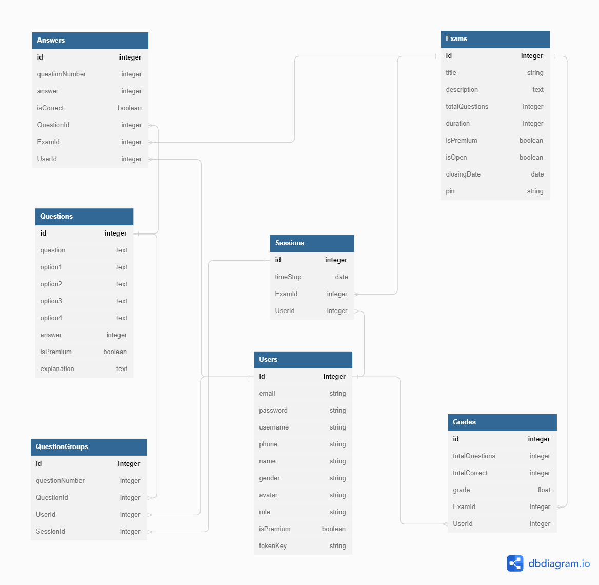

# Ujian Online

Selamat datang di aplikasi ujian online

## Models

### Users

```
    - username : string, required, unique
    - email : string, required, unique
    - password : string, required
    - phone : string
    - name : string
    - gender : string
    - avatar : string
    - role : string, required
    - isPremium : boolean, required,
    - tokenKey : string
```

### Exams

```
    - title : string, required
    - description : text
    - totalQuestions : integer, required
    - duration : integer, required
    - isPremium : boolean, required
    - isOpen : boolean, required
    - closingDate : date
    - pin : string, required
```

### Questions

```
    - question : text,  required
    - option1 : text,  required
    - option2 : text,  required
    - option3 : text,  required
    - option4 : text,  required
    - answer : string,  required
    - isPremium : boolean,  required
    - explanation : text,  required
```

### Sessions

```
    - timeStop : date, required
    - ExamId : integer, required
    - UserId : integer, required
```

### QuestionGroups

```
    - questionNumber : integer, required
    - QuestionId : integer, required
    - SessionId : integer, required
    - UserId : integer, required
```

### Answers

```
    - questionNumber : integer, required
    - answer : text, required
    - isCorrect : boolean, required
    - QuestionId : integer, required
    - ExamId : integer, required
    - UserId : integer, required
```

### Grades

```
    - totalQuestions : integer, required
    - totalCorrect : integer, required
    - grade : float, required
    - ExamId : integer, required
    - UserId : integer, required
```

## ERD



Link Online ERD [dbdiagram.io](https://dbdiagram.io/d/644a325ddca9fb07c421b1c1).

### "Sessions"."UserId" > "Users"."id"

    * `Many to one`

### "Sessions"."ExamId" > "Exams"."id"

    * `Many to one`

### "QuestionGroups"."QuestionId" > "Questions"."id"

    * `Many to one`

### "QuestionGroups"."SessionId" > "Sessions"."id"

    * `Many to one`

### "QuestionGroups"."UserId" > "Users"."id"

    * `Many to one`

### "Answers"."QuestionId" > "Questions"."id"

    * `Many to one`

### "Answers"."ExamId" > "Exams"."id"

    * `Many to one`

### "Answers"."UserId" > "Users"."id"

    * `Many to one`

### "Grades"."ExamId" > "Exams"."id"

     * `Many to one`

### "Grades"."UserId" > "Users"."id"

     * `Many to one`
